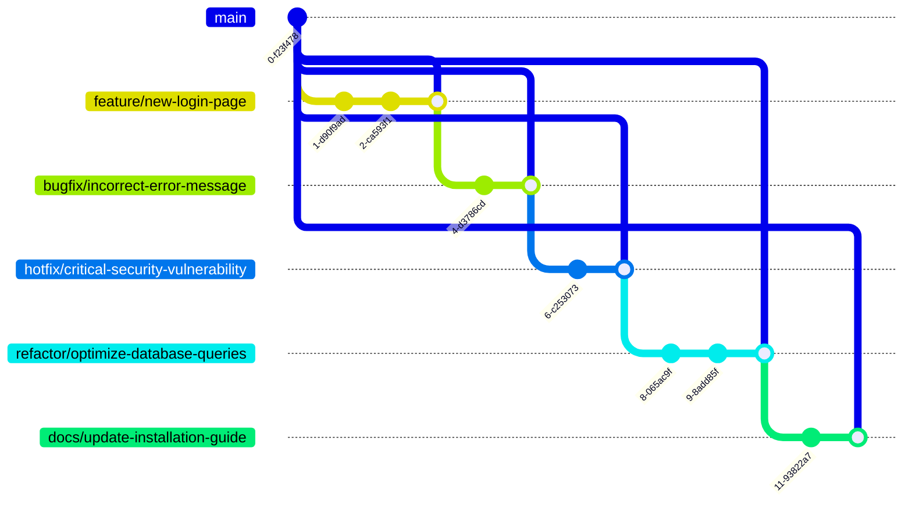

## Именование веток

Использование понятных и описательных названий веток помогает быстро понять, что за изменения вносятся в каждой ветке. Придерживайтесь единого стиля именования для всех участников проекта.

Рекомендуется использовать следующие префиксы для обозначения типа ветки:

| Префикс     | Назначение                       |
| ----------- | --------------------------------- |
| `feature/`  | Для новых функциональных возможностей |
| `bugfix/`   | Для исправления ошибок            |
| `hotfix/`   | Для срочных исправлений в production |
| `refactor/` | Для рефакторинга существующего кода |
| `docs/`     | Для изменений в документации       |

Примеры:

- `feature/new-login-page`
- `bugfix/incorrect-error-message`
- `hotfix/critical-security-vulnerability`
- `refactor/optimize-database-queries`
- `docs/update-installation-guide`

Эта схема иллюстрирует рекомендованный подход к именованию веток. Можно также создать схемы для визуализации процесса разрешения конфликтов при слиянии веток, процесса развертывания и других аспектов, упомянутых в ваших рекомендациях.
## Коммиты

Пишите понятные и информативные сообщения коммитов. Разбивайте логические изменения на отдельные коммиты. Используйте префиксы в сообщениях для обозначения типа изменений:

| Префикс | Назначение                        |
| -------- | ---------------------------------- |
| `feat:`  | Для новых функциональных возможностей |
| `fix:`   | Для исправления ошибок             |
| `refactor:` | Для рефакторинга                |
| `docs:`  | Для изменений в документации        |
| `style:` | Для изменений в стилях (форматирование, пробелы и т.д.) |
| `test:`  | Для добавления или изменения тестов |

Примеры:
- `feat: Добавлена возможность авторизации через Google`
- `fix: Исправлена ошибка при загрузке файлов`
- `refactor: Оптимизирован алгоритм сортировки`
- `docs: Обновлено руководство по установке`
- `style: Исправлено форматирование кода`
- `test: Добавлены тесты для модуля аутентификации`

## История репозитория

Регулярно выполняйте `git pull` для синхронизации с удаленным репозиторием. Используйте `git rebase` для сохранения линейной истории, а не `git merge`. Периодически `git prune` для удаления неиспользуемых веток.

Ограничивайте количество коммитов в ветке, объединяя незначительные изменения. Используйте `git reset` и `git revert` для исправления ошибок в истории.

## Работа с конфликтами

Внимательно анализируйте конфликты при слиянии веток. Используйте визуальные инструменты для разрешения конфликтов, такие как GitKraken, SourceTree или встроенные в IDE. Убедитесь, что все конфликты разрешены перед коммитом.

Задокументируйте причины возникновения конфликтов и способы их решения.

## Ведение документации

| Задача                                     | Рекомендация                                 |
| ------------------------------------------ | -------------------------------------------- |
| Поддерживать актуальный README-файл         | Описывайте проект, инструкции по установке и запуску |
| Документировать важные решения и изменения  | Используйте комментарии в коммитах             |
| Вести более подробную документацию          | Используйте wiki-страницы для описания архитектуры, процессов разработки или развертывания |

## Безопасность

| Задача                                     | Рекомендация                                 |
| ------------------------------------------ | -------------------------------------------- |
| Не хранить конфиденциальную информацию      | Пароли, ключи и другие секретные данные      |
| Использовать .gitignore                    | Исключать служебные файлы и папки (бинарные файлы, логи, временные файлы IDE) |
| Настроить права доступа к репозиторию       | Для разных ролей (чтение, запись, администрирование) |
| Регулярно обновлять Git                     | Для устранения возможных уязвимостей         |

Соблюдение этих рекомендаций поможет поддерживать репозиторий в чистом и организованном состоянии, облегчая совместную работу и дальнейшую разработку проекта.

