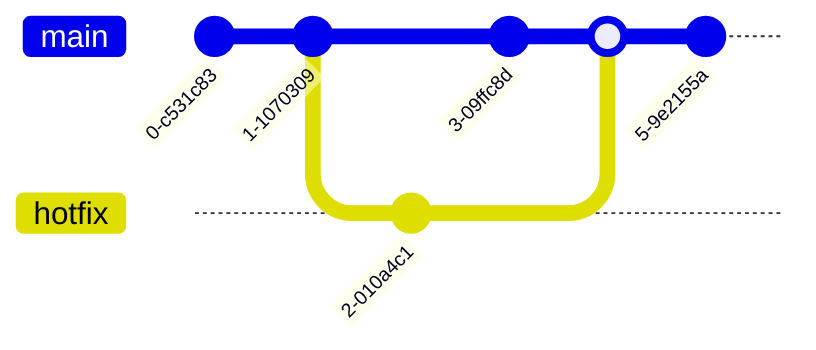
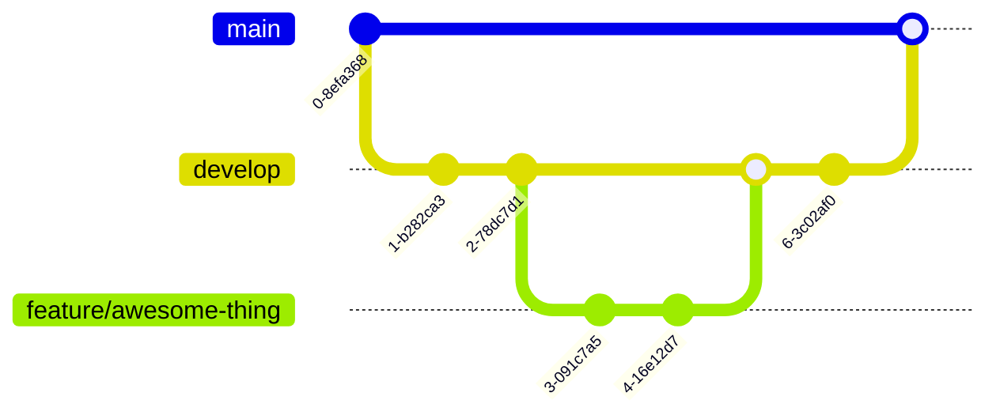
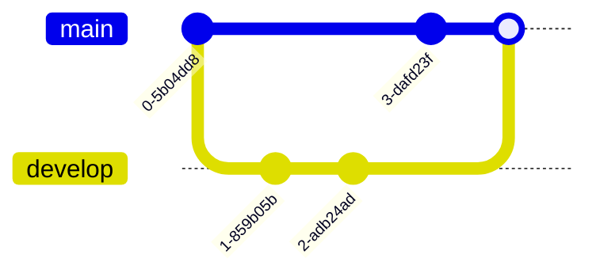

Git - это система, которая помогает разработчикам управлять изменениями в исходном коде проекта. Понимание ключевых концепций Git очень важно для эффективной работы с этой системой.

## Репозиторий

Репозиторий - это место, где хранится вся история изменений проекта. Он может быть локальным (на вашем компьютере) или удаленным (на сервере, например, GitHub, GitLab, Bitbucket).

Локальный репозиторий содержит полную историю проекта и позволяет вам работать автономно. Удаленный репозиторий используется для совместной работы, обмена изменениями и резервного копирования.

## Коммит

Коммит - это фиксация изменений, которые вы внесли в проект. Каждый коммит содержит информацию об авторе, дате, сообщении и самих изменениях. Коммиты формируют историю развития проекта.

Сообщение коммита должно быть кратким, но информативным. Оно должно описывать суть изменений, а не просто перечислять их. Например, "Исправлена ошибка в модуле авторизации" вместо "Изменены 3 файла".

## Ветки

Ветки позволяют разделять историю разработки на параллельные линии. Это дает возможность работать над различными функциональностями одновременно, не мешая друг другу.

| Название ветки | Назначение                                |
| -------------- | ------------------------------------------ |
| `master`       | Основная ветка, содержащая стабильный код |
| `develop`      | Ветка для разработки новых функций        |
| `feature/*`    | Ветки для разработки новых возможностей   |
| `bugfix/*`     | Ветки для исправления ошибок              |
| `hotfix/*`     | Ветки для срочных исправлений в `master`  |

Ветвление и слияние веток - это ключевые инструменты Git для организации workflow в команде.

## Слияние (Merge)

Слияние - это процесс объединения изменений из одной ветки в другую. Это позволяет интегрировать наработки из различных направлений разработки.

При слиянии Git пытается автоматически объединить изменения. Если это невозможно (возникают конфликты), разработчик должен вручную разрешить конфликты.

## Конфликты

Конфликты возникают, когда Git не может автоматически объединить изменения в одном и том же месте файла. В таком случае разработчик должен вручную разрешить конфликт, выбрав, какие изменения оставить.

Конфликты могут возникать при слиянии веток, при pull/push операциях, при rebasing. Важно внимательно анализировать конфликты и правильно их разрешать, чтобы не потерять важные изменения.

## Удаленные репозитории

Удаленные репозитории позволяют нескольким разработчикам совместно работать над одним проектом. Основные команды для работы с ними: `clone`, `push`, `pull`, `fetch`.

Клонирование создает локальную копию удаленного репозитория. `push` отправляет ваши локальные изменения на сервер, `pull` получает изменения с сервера. `fetch` позволяет получить информацию об удаленных ветках без применения изменений.

## Метки (Tags)

Метки позволяют помечать важные моменты в истории репозитория, например, релизы приложения. Основные команды: `tag`, `push --tags`.

Метки бывают аннотированные (с дополнительной информацией) и легковесные. Их удобно использовать для отслеживания версий, облегчения развертывания и навигации по истории.

Понимание этих ключевых концепций Git является основой для эффективной работы с системой контроля версий. Дальнейшее изучение команд и workflows поможет вам стать опытным пользователем Git.

---
[[1.1 Скачивание и установка Git.md|Назад]] | [[1.3 Руководство по использованию Git-платформы.md|Вперёд]]