## Предварительная настройка Git

Перед началом работы важно правильно настроить Git. Это делается один раз после установки:

```bash
# Установка имени пользователя для всех репозиториев
git config --global user.name "Ваше Имя"

# Установка email для всех репозиториев
git config --global user.email "your.email@example.com"

# Просмотр всех настроек
git config --list
```

## Полезные советы по использованию командной строки

1. Автодополнение команд:
   - Нажатие клавиши Tab автоматически дополняет команду Git
   - Двойное нажатие Tab показывает все возможные варианты дополнения
   - Работает для команд, веток, файлов и других параметров

2. История команд:
   - Клавиши ↑↓ позволяют перемещаться по истории выполненных команд
   - Ctrl+R позволяет искать по истории команд

## 1. Создание проекта и первый коммит

```bash
# Инициализируем Git репозиторий
git init
```

> Термин: Репозиторий (repository) - это директория проекта, в которой Git отслеживает изменения файлов. Содержит все версии файлов и историю изменений.

```bash
# Проверяем статус репозитория
git status
```

> Термин: Статус - показывает текущее состояние файлов в репозитории: отслеживаемые/неотслеживаемые, измененные, добавленные в индекс.

```bash
# Добавляем файл в индекс
git add README.md

# Создаём первый коммит
git commit -m "Первый commint: add README.md"
```


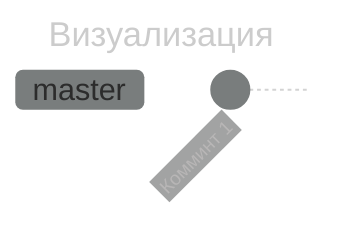
## 2. Добавление кода и второй коммит

```bash
# Создаём файл с кодом
index.py

# Проверяем статус
git status
```

> Термин: Рабочая директория (working directory) - это каталог с файлами проекта, где вы непосредственно работаете с файлами.


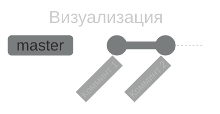
## 3. Внесение изменений в существующий файл

```bash
# Изменяем код в index.py
index.py

# Смотрим изменения
git diff
```

> Термин: diff - показывает различия между текущим состоянием файлов и последним коммитом или индексом.


## 4. Работа с ветками

> Термин: Ветка (branch) - это независимая линия разработки, позволяющая работать над разными функциями параллельно, не затрагивая основной код.

```bash
# Смотрим текущие ветки
git branch
```


```bash
# Создаём новую ветку для новой функции
git branch feature/goodbye
```

> Совет: Используйте осмысленные названия веток, например:
> - feature/* - для новых функций
> - bugfix/* - для исправления ошибок
> - hotfix/* - для срочных исправлений
> - release/* - для подготовки релизов

```bash
# Проверяем список веток
git branch
```


```bash
# Переключаемся на новую ветку
git checkout feature/goodbye
```


```bash
# изменяем файл в этой ветке
index.py

# Смотрим изменения
git status
```


```bash
# Коммитим изменения в новой ветке
git add index.py
git commit -m "Add goodbye function"
```


```bash
# Проверяем лог
git log --oneline
```


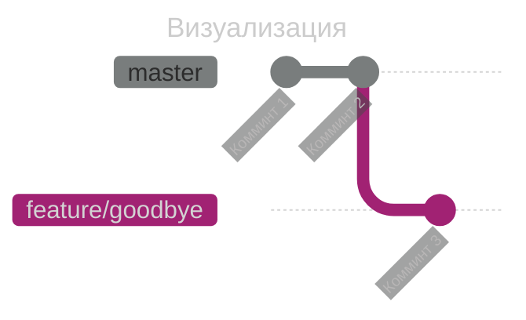
## 5. Слияние веток

> Термин: Слияние (merge) - процесс объединения изменений из разных веток в одну.

```bash
# Возвращаемся в основную ветку
git checkout master

# Сливаем изменения из feature-ветки
git merge feature/goodbye-function
```


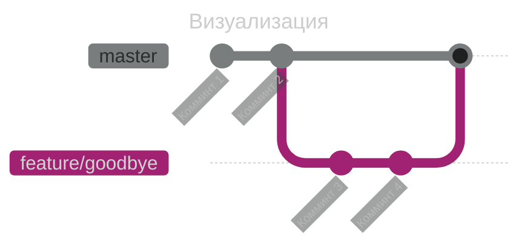
## 6. Работа с конфликтами

```bash
# Смотрим на какой мы ветке
git branch
```


```bash
# Создаём новую ветку
git branch new
```


```bash
# Переключаемся на новую ветку
git checkout new
```


```bash
# Изменяем файл функцию в первой ветке
index.py

# Смотрим статус изменений
git status
```


```bash
# Добавляем изменения в индекс
git add index.py
```


```bash
# Создаём коммит в первой ветке
git commit -m "Change"
```


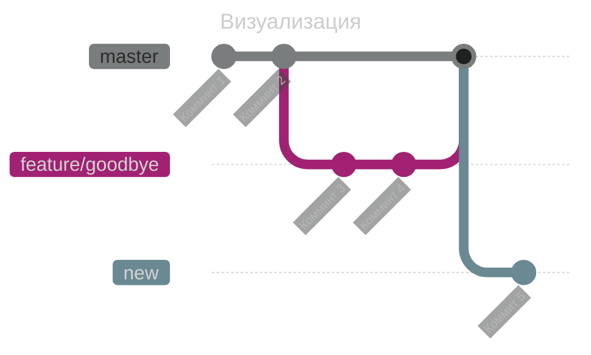

```bash
# Переключаемся обратно в main
git checkout master
```


```bash
# Создаём конфликтующие изменения в master
index.py

# Проверяем статус
git status
```


```bash
# Добавляем изменения в индекс
git add index.py

# Создаём коммит в main
git commit -m "Change 2"
```


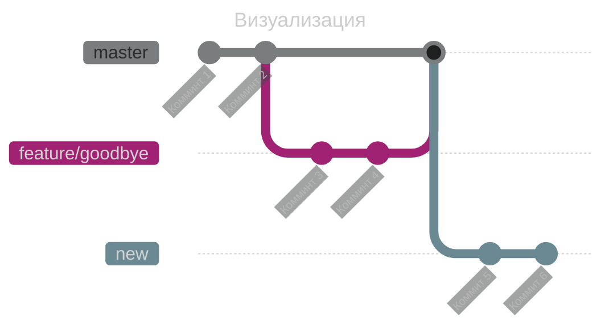

```bash
# Пытаемся слить ветку new в main
git merge new
```


```bash
# Проверяем статус после конфликта
git status
```


```bash
# Открываем файл и видим конфликт
cat index.py
```


```shell
<<<<<<< HEAD
print("hello world")
=======
print("sdsd")
printe("hi worled and hello world")
>>>>>>> new
```

> Термин: Конфликт - ситуация, когда Git не может автоматически объединить изменения из разных веток, требуется ручное разрешение.

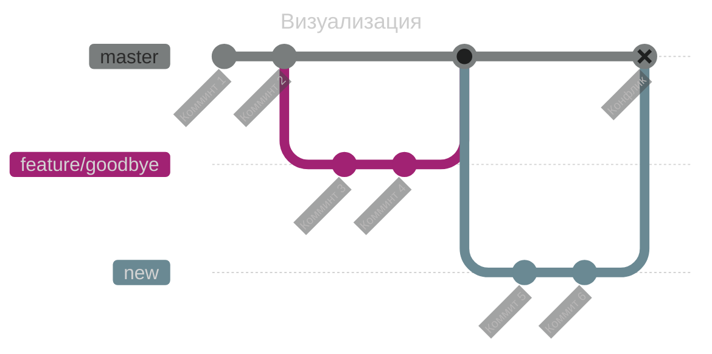

Признаки конфликта в файле:
```shell
<<<<<<< HEAD
[текущие изменения]
=======
[входящие изменения]
>>>>>>> [имя ветки]
```

```bash
# Решаем конфликт, выбирая нужную версию или объединяя их
# Например, делаем такую версию:
print("sdsd")
print("hello world")
 > index.py

# Проверяем изменения
git status
```


```bash
# Добавляем решенный файл в индекс
git add index.py
```


```bash
# Завершаем слияние создавая коммит
git commit -m "Решение слияния"
```


```bash
# Проверяем историю
git log --oneline
```


```bash
# Проверяем финальное содержимое файла
cat index.py
```


```bash
# Проверяем, что все чисто
git status
```


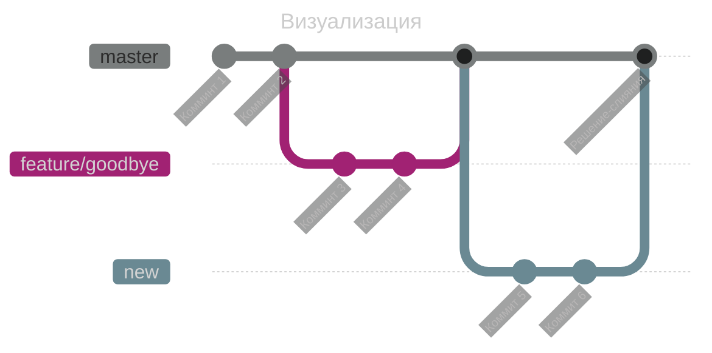

## 7. Просмотр истории

```bash
git log --graph --oneline --all
```


> Термин: Лог (log) - история коммитов с информацией об авторе, дате и сообщении коммита.

## 8. Работа с метками (tags)

> Термин: Тег (tag) - именованная метка на определённом коммите, обычно используется для маркировки версий релиза.

```bash
# Просмотр существующих тегов
git tag
```


```bash
# Создание аннотированного тега
git tag -a v1.0 -m "Version 1.0 release"
```


```bash
# Просмотр информации о конкретном теге
git show v1.0
```


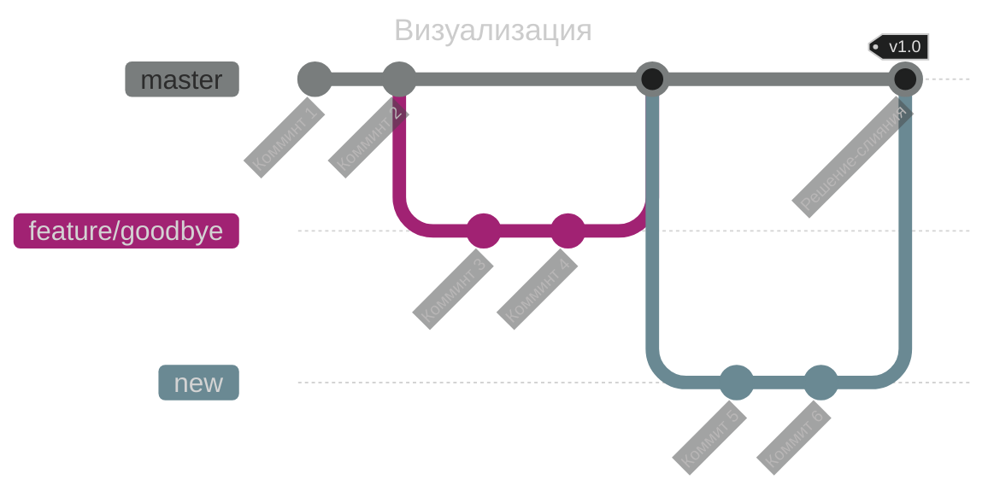

```bash
# Создание легковесного тега
git tag v1.0-beta
```


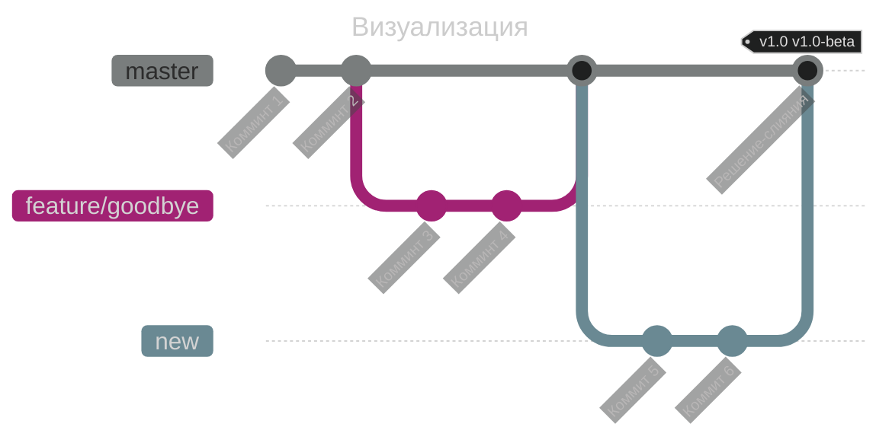

```bash
# Просмотр тегов с шаблоном
git tag --list "v1.*"
```


```bash
# Создание тега для определённого коммита
git tag -a v0.9 5e0eeba -m "начало"
```


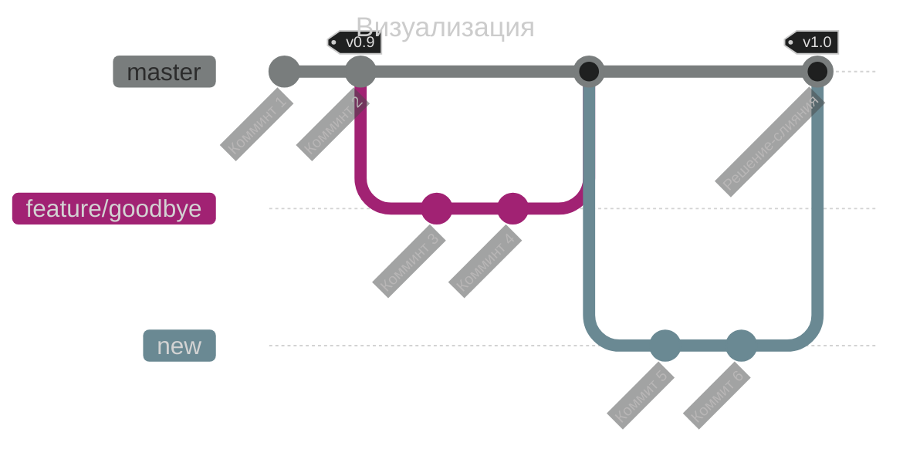

```bash
# Удаление тега
git tag --delete v1.0-beta
```


```bash
# Проверка тегов после удаления
git tag
```


```bash
# Поиск коммита по тегу
git checkout v1.0
```


```bash
# Возврат к последнему состоянию master
git checkout master
```


```bash
# Просмотр истории с тегами
git log --oneline --decorate
```


## 9. Итоговая структура проекта

Пояснение структуры:
- README.md - файл с описанием проекта
- index.py - основной файл с кодом
- .git/ - служебная директория Git (скрытая)

## 10. Проверка статуса в конце

```bash
git status
git log --oneline
```


## Дополнительные советы:

1. Используйте .gitignore для исключения файлов:
```bash
# Создание .gitignore
echo "*.log\nnode_modules/\n.env" > .gitignore
```

2. Отмена последних действий:
```bash
# Отмена изменений в файле
git checkout -- filename

# Отмена последнего коммита (сохраняя изменения)
git reset --soft HEAD^
```

3. Просмотр изменений:
```bash
# Показать изменения в определённом коммите
git show commit_hash

# Показать кто менял каждую строку
git blame filename
```