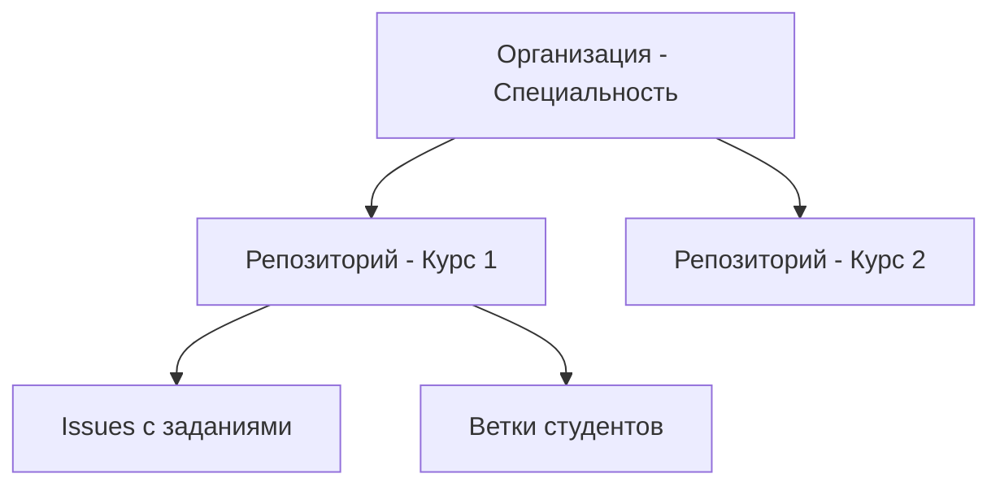

## Что такое наша Git-платформа?
Это внутренний аналог GitHub, специально разработанный для образовательного процесса. Платформа позволяет организовать эффективное взаимодействие между преподавателями и студентами при выполнении практических заданий.

## Структура платформы



### Организации
- Названы по специальностям
- Содержат все репозитории курсов данной специальности
- Управляются преподавателями

### Репозитории
- Представляют отдельные курсы
- Содержат задания в Issues
- Имеют основную ветку main
- Включают ветки студентов с выполненными работами

## Роли пользователей

### Преподаватель

#### Права и возможности:
- Управление репозиториями курсов
- Создание и публикация заданий
- Проверка работ студентов
- Управление Pull Request'ами
- Комментирование кода
- Принятие или отклонение изменений

#### Как создать задание:
1. Открыть нужный репозиторий курса
2. Перейти в раздел Issues
3. Создать новый Issue:
   - Указать название задания
   - Написать подробное описание
   - Установить сроки выполнения
   - Добавить необходимые метки

#### Как проверить работу:
1. Открыть Pull Request студента
2. Просмотреть изменения
3. Оставить комментарии если необходимо
4. Принять (merge) или отклонить изменения

###  Студент

#### Права и возможности:
- Просмотр заданий
- Создание собственных веток
- Загрузка выполненных работ
- Создание Pull Request'ов

#### Как выполнить задание:
1. Найти свою организацию (специальность)
2. Выбрать репозиторий курса
3. Просмотреть задание в Issues
4. Создать новую ветку:

   ```bash
   git checkout -b <название_задания>
   ```

1. Выполнить работу
2. Загрузить изменения:

   ```bash
   git add .
   git commit -m "описание изменений"
   git push origin <название_ветки>
   ```
   
1. Создать Pull Request в основную ветку

## Процесс работы

### 1. Получение доступа

> ⚠️ Доступ предоставляется только администратором системы

### 2. Вход в систему

1. Перейти на сайт платформы
2. Ввести предоставленные учетные данные
3. Найти свою организацию

### 3. Навигация по платформе

- Организации → Репозитории → Issues/Ветки
- Использовать поиск для быстрого доступа
- Следить за уведомлениями о новых заданиях

## Технические требования

### Необходимое ПО:

1. Git
2. Текстовый редактор/IDE
3. Терминал

### Базовые навыки:

- Понимание Git-команд
- Работа с командной строкой
- Основы ветвления в Git

## Важные правила

### Безопасность:

1. Не передавать учетные данные
2. Работать только в своих ветках
3. Регулярно обновлять основную ветку

### Именование:

- Ветки: `task-название_задания`
- Коммиты: краткое описание изменений
- Pull Request: номер задания и краткое описание

## Рабочий процесс

### Для преподавателей:

1. Создание задания в Issues
2. Ожидание Pull Request'ов
3. Проверка работ
4. Обратная связь студентам

### Для студентов:

1. Просмотр заданий
2. Создание ветки
3. Выполнение работы
4. Создание Pull Request
5. Внесение правок при необходимости

## Лучшие практики

### При работе с кодом:

- Регулярные коммиты
- Понятные описания изменений
- Проверка кода перед отправкой
- Следование стандартам оформления